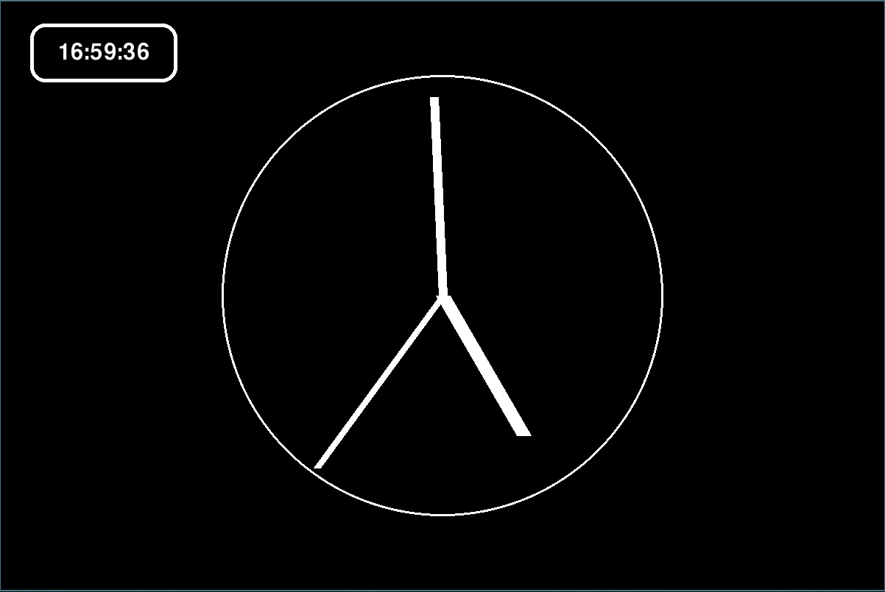

# Analog Clock

A desktop application that displays a real-time analog clock with hour, minute, and second hands, as well as a digital time display.

## Features

- Analog clock with moving hands
- Digital clock display
- Built with [Pygame](https://www.pygame.org/)

## Installation

1. Install Python 3.14+.
2. Install dependencies:  
   ```bash
   pip install pygame
   ```
## Screenshot



## License

[MIT License](LICENSE)

